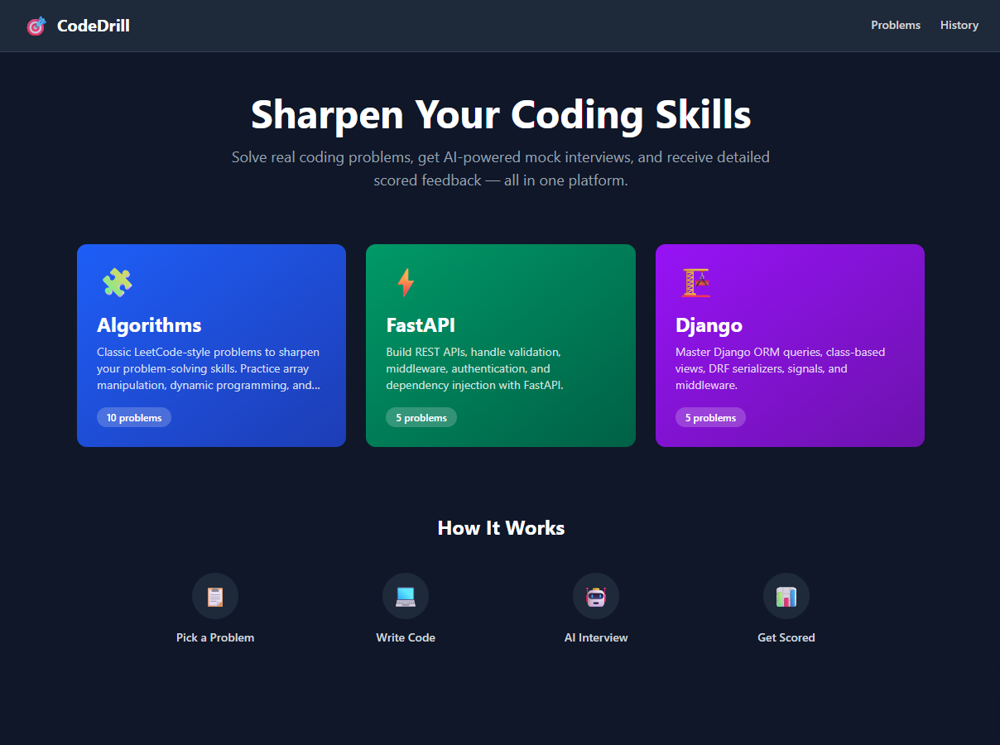
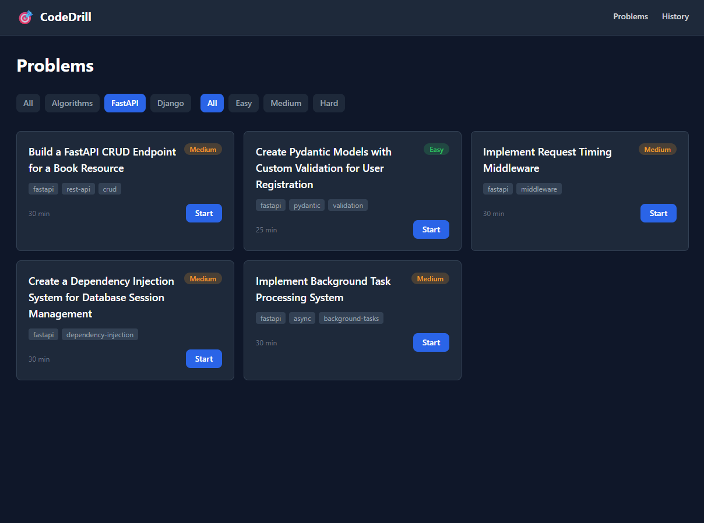
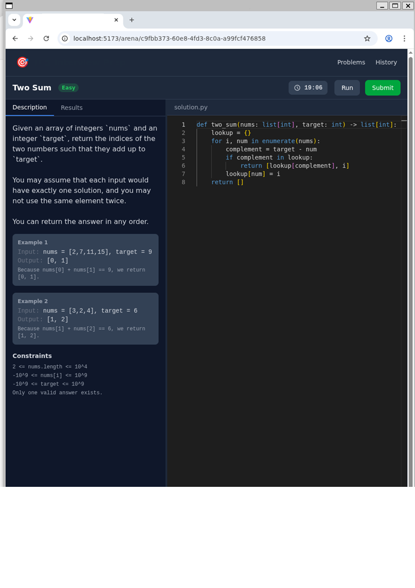
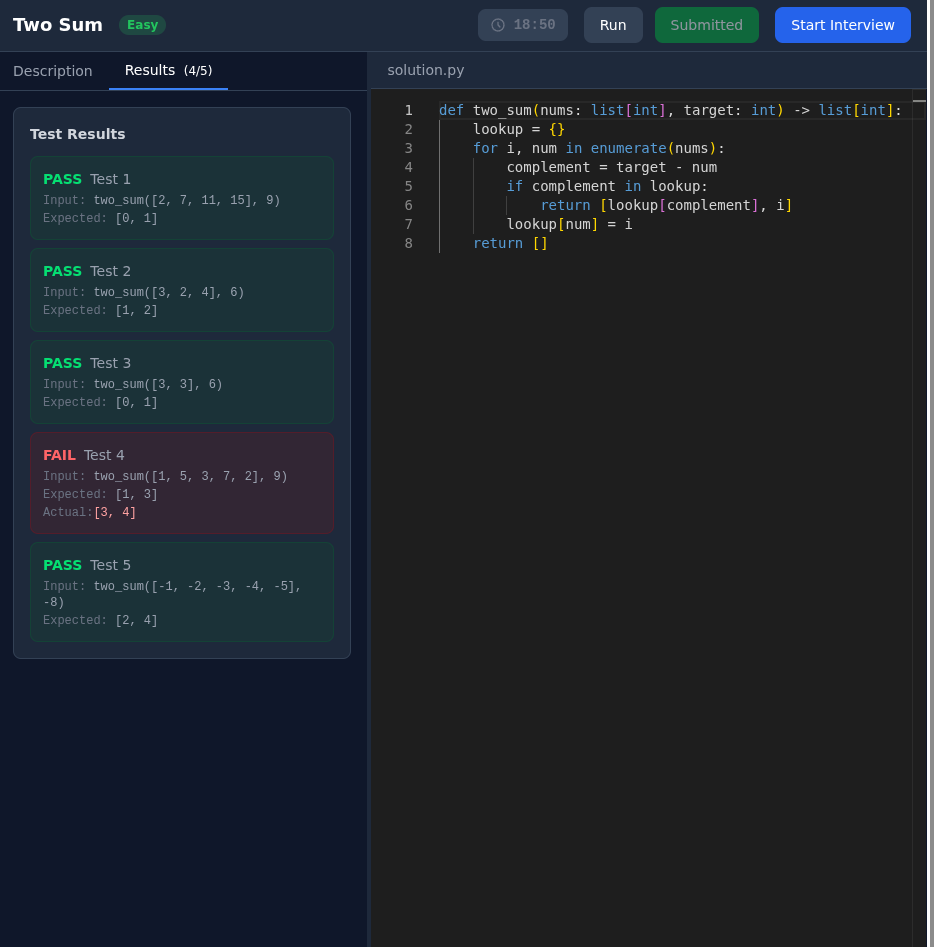
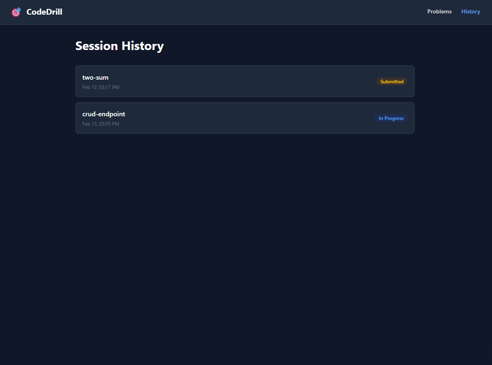
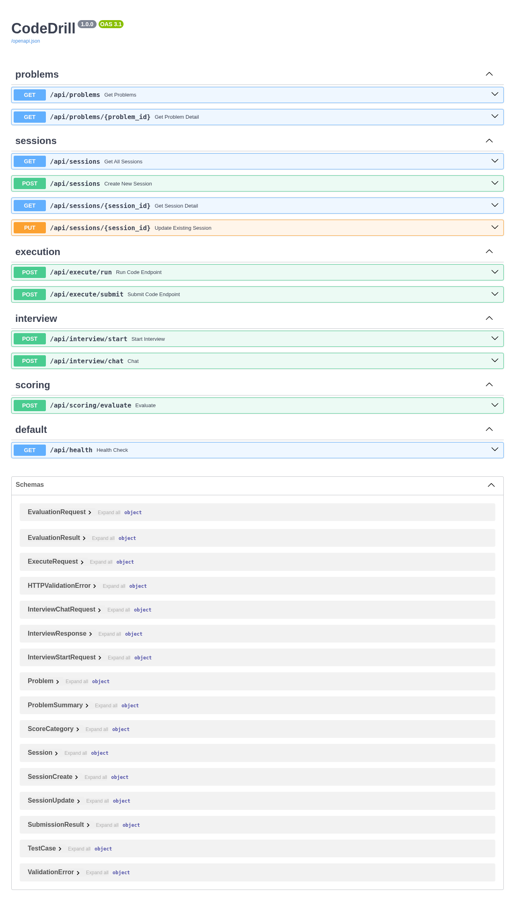
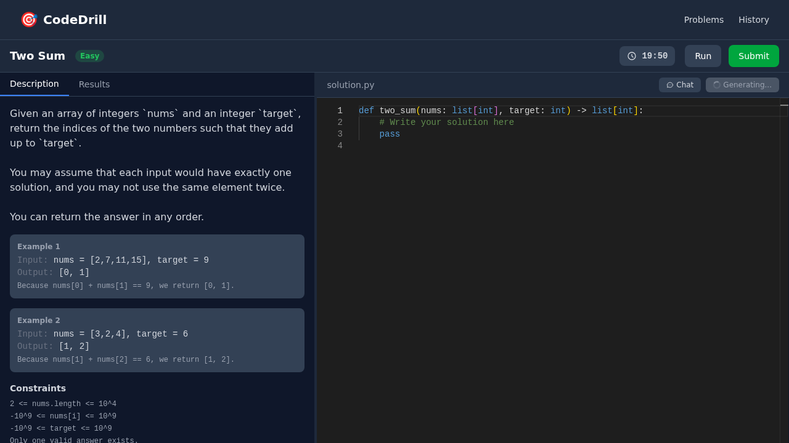
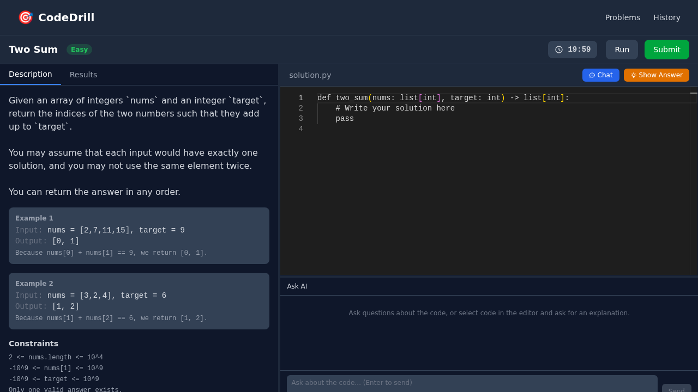
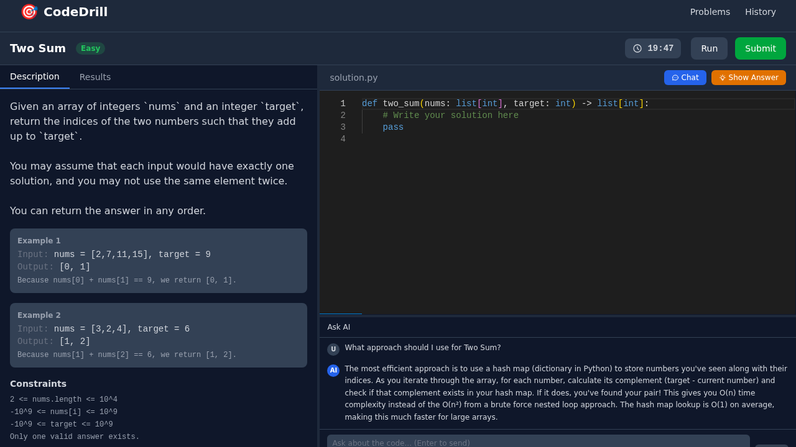
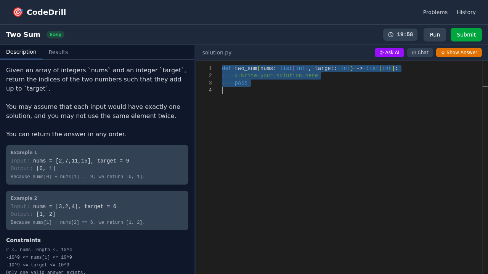

# CodeDrill — AI Mock Interview Platform

[](https://github.com/osisdie/codedrill-mock-interview/actions)
[](LICENSE)
[](https://www.python.org/)
[](https://vuejs.org/)
[](docker-compose.yml)

Practice coding problems, get AI-powered mock interviews, and receive scored feedback — all in one platform.

> **[Live Demo](https://osisdie.github.io/codedrill-mock-interview/)** — Try it instantly in your browser (no setup required). Code execution and AI features require the full local version.

## Preview

Screenshots of the main workflow: home → problems → coding arena → test results → session history. API docs available at `/docs`.

| Home — Pick a category | Problems — Browse & filter |
|:---:|:---:|
|  |  |

| Coding Arena — Write & run code | Test Results — Submit & start interview |
|:---:|:---:|
|  |  |

| Session History | API Documentation |
|:---:|:---:|
|  |  |

### New: Show Answer, Code Chat & Ask AI

| Show Answer — AI types the solution | Chat Panel — Ask questions about code |
|:---:|:---:|
|  |  |

| Chat Conversation — AI explains approaches | Ask AI — Select code for explanation |
|:---:|:---:|
|  |  |

## Features

- **73 Coding Problems** — Algorithms, FastAPI, Django, Pytest, and Python problems with automated test cases
- **Python Sandbox** — Secure, isolated code execution for your solutions
- **AI Mock Interview** — Senior technical interviewer powered by LLM (OpenRouter)
- **Scored Feedback** — Detailed evaluation of your code and interview performance
- **Show Answer** — AI-generated solutions typed out character by character with block-aware pacing
- **Code Chat** — In-editor AI chatroom to ask questions about the problem or your code
- **Ask AI** — Select any code block in the editor and ask AI for an explanation

## Tech Stack

| Layer   | Stack                          |
|---------|---------------------------------|
| Backend | FastAPI, Python 3.x             |
| Frontend| Vue 3, Vite, Tailwind CSS, Monaco Editor |
| AI      | OpenRouter (Claude)             |
| E2E Test| Playwright                     |

## Getting Started

### Prerequisites

- Python 3.12+
- Node.js 18+ with [pnpm](https://pnpm.io/) (`corepack enable && corepack prepare pnpm@latest --activate`)
- [OpenRouter](https://openrouter.ai/) API key

### Installation

```bash
# Clone the repo
git clone https://github.com/osisdie/codedrill-mock-interview.git
cd codedrill-mock-interview

# Install dependencies
make install
```

### Configuration

1. Copy the example env file and add your API key:

   ```bash
   cp backend/.env.example backend/.env
   ```

2. Edit `backend/.env`:

   ```
   OPENROUTER_API_KEY=your-openrouter-api-key-here
   ```

3. (Optional) Frontend API base URL — edit `frontend/.env.example` if needed:

   ```
   VITE_API_BASE_URL=http://localhost:8573
   ```

### Run

```bash
# Terminal 1 — backend
make dev-backend

# Terminal 2 — frontend
make dev-frontend
```

- Backend: http://localhost:8573
- Frontend: http://localhost:5573
- API docs: http://localhost:8573/docs

**Docker** (`make up`): Same URLs — backend 8573, frontend 5573.

## Project Structure

```
codedrill-mock-interview/
├── backend/           # FastAPI app
│   ├── app/
│   │   ├── routers/   # API routes (problems, sessions, execution, interview, scoring)
│   │   ├── services/  # AI, executor, scoring, session logic
│   │   ├── sandbox/   # Code execution sandbox
│   │   └── data/      # Problem definitions (JSON)
│   └── main.py
├── frontend/          # Vue 3 SPA
│   ├── src/
│   │   └── demo/      # Demo mode mock layer (GitHub Pages)
│   └── e2e/           # Playwright E2E tests
├── scripts/           # Start/generate scripts
└── docs/
```

## Ports

| Service  | Host  | Container (Docker) |
|----------|-------|--------------------|
| Backend  | 8573  | 8000               |
| Frontend | 5573  | 5173               |

## Environment Variables

| Variable           | Description                          | Default |
|--------------------|--------------------------------------|---------|
| `OPENROUTER_API_KEY` | OpenRouter API key (required for AI) | —       |
| `OPENROUTER_MODEL` | Model to use                         | `anthropic/claude-sonnet-4-20250514` |
| `CORS_ORIGINS`     | Allowed CORS origins (frontend URL)   | `["http://localhost:5573"]` |
| `SANDBOX_TIMEOUT`  | Code execution timeout (seconds)    | `10`    |
| `SANDBOX_MAX_MEMORY_MB` | Max memory per run (MB)         | `256`   |

## Roadmap

- [ ] JavaScript / TypeScript problems
- [ ] Real-time collaborative interviews
- [ ] Difficulty rating system
- [ ] Multi-language execution (Go, Java, Rust)

## Contributing

See [CONTRIBUTING.md](CONTRIBUTING.md) for guidelines.

## License

[MIT](LICENSE)
